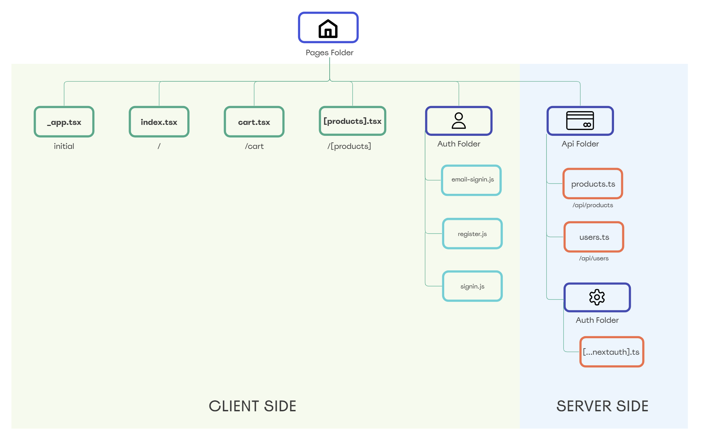
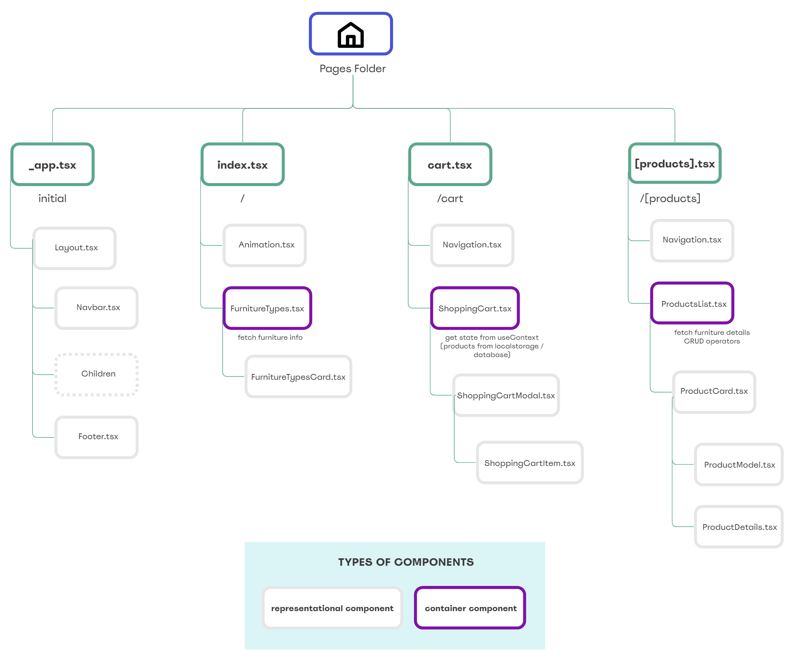

# 3D FURNITURE SHOP
> The app is hosted in Vercel [_HERE._](https://3d-shop-new.vercel.app/)

## Table of Contents
* [General Info](#general-information)
* [Technologies Used](#technologies-used)
<!-- * [Features](#features)
* [Screenshots](#screenshots)
* [Folders Structure](#folders-structure)
* [Client Side Components Structure](#client-side-components-structure)
* [Setup](#setup) -->
* [Project Status](#project-status)
<!-- * [Future features](#future-features) -->

## General Information

### Idea
This full stack app was created in order to make online shopping more user friendly. 3D models are more appealing for potential customers.

## Technologies Used
### Front-end
- TypeScript
- Next.JS
- Three.JS
- Tailwind
- GreenSock

### Back-end
- Next.JS API (serverless)

### Database
- PostgreSQL + Prisma

### Deployment and hosting
- Vercel
- GitHub actions for CI/CD pipeline
- Heroku Postgres Add-ons

<!-- ## Features
So far, I have incorporated the following features:

- user can display 3D models from different perspectives
- user can open life preview of 3D models and zoom in to see details
- user can add/subtract products to/from a cart when is not logged-in
- user authentication (login with email / google / github) - next-auth
- user can create a new account
- when user is logged-in, can add/delete products to an account
- total price of a cart is shown

## Bugs
I am still working on the bugs:

- the main GreenSock animation is displaying incorrectly from time to time
- update products in database
- rerender components after changes in database

## Screenshots
https://user-images.githubusercontent.com/57223600/179953149-ebf115e9-140d-4945-b6e9-ea5d426ff24c.mp4

## Folders Structure

## Client Side Components Structure

## Setup
If anybody wants to clone this project, they have to install dependencies using `npm install`, and then run the development local server using `npm run dev`. A list with all scrips is found in the package.json file.

In order to run a local copy, users need to include an .env file in the server folder with the following information:
- DATABASE_URL - URL to postgreSQL database.
- GOOGLE_ID - Google credentials to enable authentication 
- GOOGLE_SECRET - Google credentials to enable authentication 
- GITHUB_CLIENT_ID - Google credentials to enable authentication 
- GITHUB_CLIENT_SECRET - Google credentials to enable authentication
- NEXTAUTH_URL - website url
- SECRET - secret created randomly. You can use https://generate-secret.vercel.app/32 to generate it. -->

## Project Status
The project is currently on progress and additional features will be included in the future.

<!-- ## Future features
- payments
- 3D custom configurator based on parameters -->